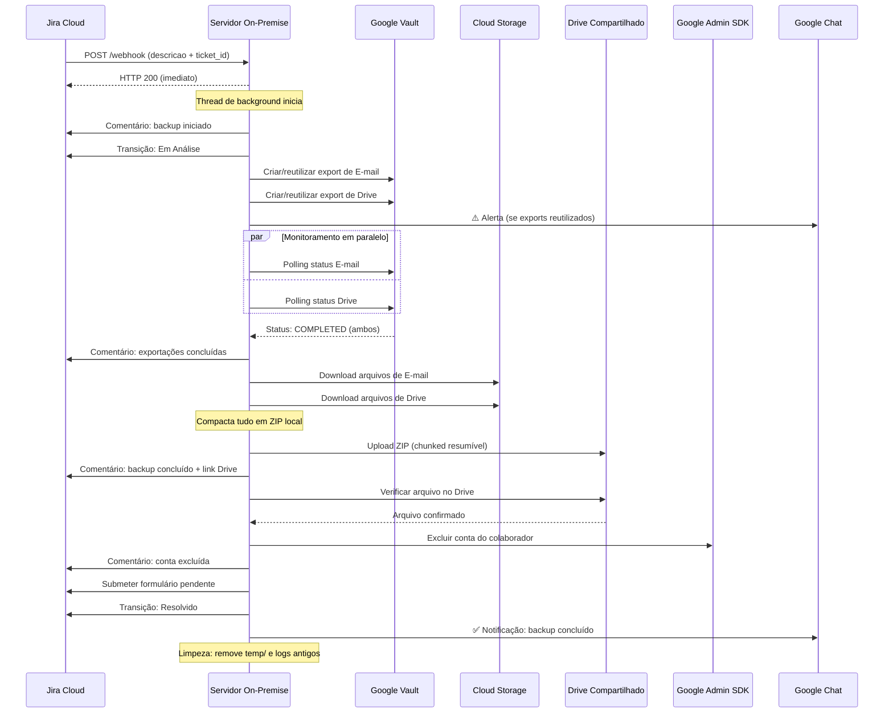

# Arquitetura — Automação de Backups (On-Premise)

## Diagrama Geral

```mermaid
graph TB
    subgraph JIRA["☁️  Jira Cloud (madeiramadeira.atlassian.net)"]
        JA["Automation for Jira<br/>Cria chamado SPN filho<br/>Dispara webhook"]
        JAPI["Jira REST API v3<br/>Recebe comentários,<br/>transições e formulários"]
    end

    subgraph GOOGLE["☁️  Google Cloud (APIs externas)"]
        VAULT["Google Vault API<br/>Cria e monitora exports<br/>de E-mail e Drive"]
        GCS["Google Cloud Storage<br/>Armazena os arquivos<br/>exportados pelo Vault"]
        GDRIVE["Google Drive API<br/>Drive Compartilhado<br/>Destino do backup ZIP"]
        GADMIN["Google Admin SDK<br/>Exclusão da conta<br/>do colaborador"]
        GCHAT["Google Chat<br/>Webhook de notificações"]
    end

    subgraph SERVER["🖥️  Servidor On-Premise"]
        FW["🔒 Firewall<br/>Porta 5000 aberta<br/>para Jira Cloud"]

        subgraph APP["Aplicação (Gunicorn + Flask)"]
            WH["Webhook Handler<br/>Valida HMAC<br/>Extrai e-mail via regex"]
            DASH["Dashboard Web<br/>:5000/dashboard"]
        end

        subgraph PROC["Processamento (Thread Background)"]
            ORC["Orquestrador<br/>Coordena 8 etapas"]
            COMP["Compactação<br/>Gera ZIP"]
            CLEAN["Limpeza<br/>Remove temporários e<br/>logs antigos"]
        end

        subgraph SERV["Serviços (Integrações)"]
            AUTH["Google Auth<br/>Service Account +<br/>Domain-Wide Delegation"]
            VAULT_SVC["Vault Service<br/>Cria / reutiliza / baixa"]
            DRIVE_SVC["Drive Upload<br/>Chunked via requests"]
            JIRA_SVC["Jira Service<br/>Comentários / Transições /<br/>Formulários"]
            CHAT_SVC["Google Chat<br/>Alertas e notificações"]
            CONTA_SVC["Conta Exclusão<br/>Verifica backup →<br/>deleta conta"]
        end

        subgraph STORAGE["💾 Armazenamento Local"]
            TEMP["temp/<br/>Arquivos temporários<br/>durante o backup"]
            LOGS["logs/<br/>automacao_backups.log<br/>Retenção: 30 dias / 10 GB"]
            CRED["config/credenciais/<br/>service-account.json"]
        end
    end

    %% Fluxo de entrada
    JA -->|"POST /webhook/backup-desligado<br/>HTTPS porta 5000<br/>{ descricao, ticket_id }"| FW
    FW --> WH
    WH -->|"Inicia thread"| ORC

    %% Orquestrador → Serviços
    ORC --> VAULT_SVC
    ORC --> DRIVE_SVC
    ORC --> JIRA_SVC
    ORC --> CHAT_SVC
    ORC --> CONTA_SVC
    ORC --> COMP
    ORC --> CLEAN

    %% Serviços → Google APIs
    AUTH --> VAULT_SVC
    AUTH --> DRIVE_SVC
    AUTH --> CONTA_SVC
    VAULT_SVC -->|"Cria / monitora exports"| VAULT
    VAULT_SVC -->|"Download dos arquivos"| GCS
    DRIVE_SVC -->|"Upload ZIP"| GDRIVE
    CONTA_SVC -->|"Verifica arquivo"| GDRIVE
    CONTA_SVC -->|"Deleta conta"| GADMIN
    CHAT_SVC -->|"Cards formatados"| GCHAT

    %% Serviços → Jira
    JIRA_SVC -->|"Comentários, transições,<br/>submissão de formulário"| JAPI

    %% Armazenamento
    VAULT_SVC -->|"Salva arquivos"| TEMP
    COMP -->|"Lê arquivos"| TEMP
    COMP -->|"Gera ZIP"| TEMP
    DRIVE_SVC -->|"Lê ZIP"| TEMP
    CLEAN -->|"Remove após upload"| TEMP
    CLEAN -->|"Remove logs > 30d / 10GB"| LOGS
    CRED -->|"Autentica"| AUTH

    %% Estilos
    classDef cloud fill:#e3f2fd,stroke:#1565c0,color:#0d47a1
    classDef server fill:#e8f5e9,stroke:#2e7d32,color:#1b5e20
    classDef storage fill:#fff8e1,stroke:#f57f17,color:#e65100
    classDef external fill:#fce4ec,stroke:#880e4f,color:#880e4f

    class JIRA,GOOGLE cloud
    class APP,PROC,SERV server
    class STORAGE storage
```

---

## Fluxo de Dados por Etapa

---

## Portas e Protocolos

| Direção | Origem | Destino | Porta | Protocolo |
|---|---|---|---|---|
| Entrada | Jira Cloud | Servidor On-Premise | **5000** | HTTPS |
| Saída | Servidor | Jira Cloud | 443 | HTTPS |
| Saída | Servidor | Google APIs (Vault, Drive, Admin, Chat) | 443 | HTTPS |
| Saída | Servidor | Google Cloud Storage | 443 | HTTPS |

> Apenas a **porta 5000 de entrada** precisa estar liberada no firewall.
> Toda a saída é HTTPS padrão (porta 443).

---

## Componentes do Servidor

| Componente | Tecnologia | Função |
|---|---|---|
| Servidor web | Gunicorn + Flask | Recebe e responde o webhook |
| Processamento | Python Threading | Executa o backup em background |
| Autenticação Google | Service Account JSON | Domain-Wide Delegation para todas as APIs |
| Armazenamento temporário | Disco local (`temp/`) | Arquivos durante o processamento |
| Logs | Disco local (`logs/`) | Retenção: 30 dias ou 10 GB |
| Processo supervisor | systemd | Reinicia automaticamente se cair |
